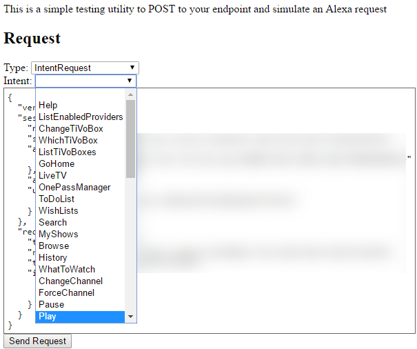

# alexa_tivo_control
Alexa skill to control a TiVo DVR with the Amazon Echo and voice commands

- - -
## Requirements

* [Node](https://nodejs.org/en/)
* [Alexa-App-Server](https://www.npmjs.com/package/alexa-app-server)
* [Alexa-App](https://www.npmjs.com/package/alexa-app)

- - -
## Installation Instructions

1. Clone this repository into your Alexa-App-Server apps directory:
   ```
   git clone https://github.com/jradwan/alexa_tivo_control.git
   ```

2. Install any missing dependencies (telnet-client, etc.):
   ```
   npm install
   ```

3. Copy config_example.json to config.json:
   ```
   cp config_example.json config.json
   ```

   Edit the config.json file and make the following changes:
   ```
   tivoIP: enter the IP address of the TiVo to control
   tivoMini: set to 'true' if controlling a TiVo Mini
   ```
   
   If you've hidden unused Video Providers on your TiVo (under Settings & Messages > Settings > Channels > My Video Providers), set the corresponding entries in the file to 'false'. For example: 
   ```
   "hbogo": false,
   "amazon": true,
   "netflix": false,
   "hulu": false,
   "youtube": true,
   "mlbtv": false,
   "plex": true,
   "vudu": true,
   "hsn": false,
   "aol": false,
   "flixfling": false,
   "toongoggles": false,
   "wwe": false,
   "yahoo": false,
   "yupptv": false,
   ```

   Audio providers are normally not customizable on the TiVo so those settings should be left as 'true'. If for some reason a provider does *not* appear on your TiVo, you can set the corresponding entry to 'false'.
   ```  
   "pandora": true,
   "spotify": false,
   "iheartradio": true
   ```

   These settings are used to dynamically generate remote key-presses for menu navigation so incorrect settings could cause unexpected navigation.

4. Start the Alexa-App-Server:
   ```
   node server.js
   ```

   You should see the TiVo Control app registered as an endpoint in the console log:
   ```
   Serving static content from: public_html
   Loading server-side modules from: server
      Loaded /opt/alexa-app-server/server/login.js
   Loading apps from: apps
      Loaded app [alexa_tivo_control] at endpoint: /tivo_control
   Listening on HTTP port 8085
   ```

5. Enable the network remote control on your TiVo (under Settings & Messages > Remote, CableCARD, & Devices > Network Remote Control.

6. In a browser, open the TiVo Control endpoint on your Alexa-App-Server (i.e., http://localhost:8085/tivo_control) and you should see the Alexa Tester page. Here you can set the "Type" field to "IntentRequest", choose an "Intent" (i.e., action) from the dropdown menu, and click "Send Request" to trigger the intent.

   
   
   For example: select "Pause" from the dropdown and click "Send Request." If your configuration is correct and working, your TiVo should pause. Select "Play" then "Send Request" and playback should resume. The console log will show debugging information:

   ```
   QueuedCommands: PAUSE
   Connection Created
   RECEIVED: CH_STATUS 1287 LOCAL
   Sending Prefixed Command: IRCODE PAUSE
   QueuedCommands: PLAY
   Connection Created
   RECEIVED: CH_STATUS 1287 LOCAL
   Sending Prefixed Command: IRCODE PLAY
   ```

   You can test the other intents (such as launching the video/audio providers) on this page to confirm your configuration settings.

- - -
## Contact

Jeremy C. Radwan

- https://github.com/jradwan
- http://www.windracer.net/blog

- - -
## References

[Tivo Network Remote Documentation](http://www.tivo.com/assets/images/abouttivo/resources/downloads/brochures/TiVo_TCP_Network_Remote_Control_Protocol.pdf)

This project was forked from https://github.com/grgisme/alexa_tivo_control
